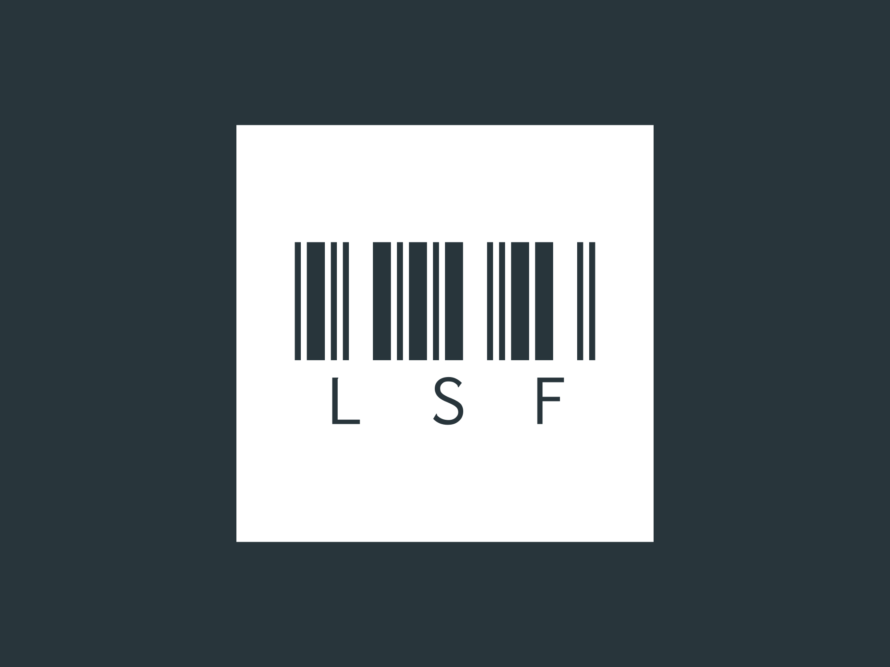

  
  <h1 align="center">lsf</h1>
  
The LogiSploit framework

## LogiSploit Framework

###### Install
> git clone https://github.com/Rayan25062011/lsf

> chmod +x modules

> python3 lsf.py

## Disclamer
! The author is not responsible for any damage delt by the user !

###### Photo example

